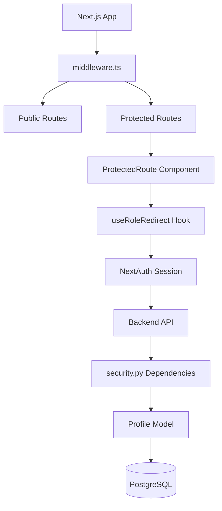
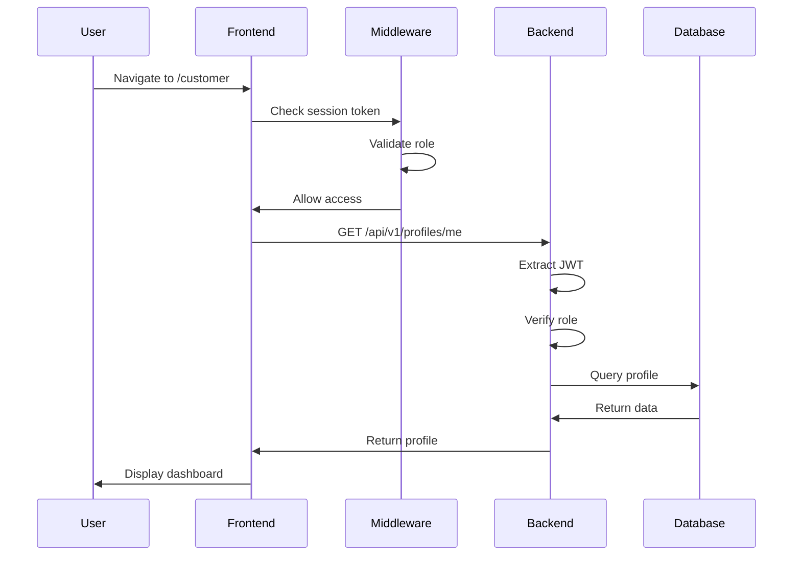
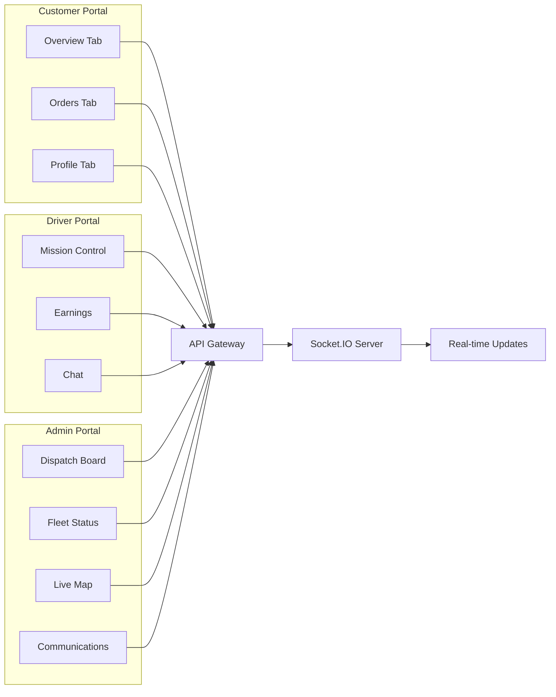
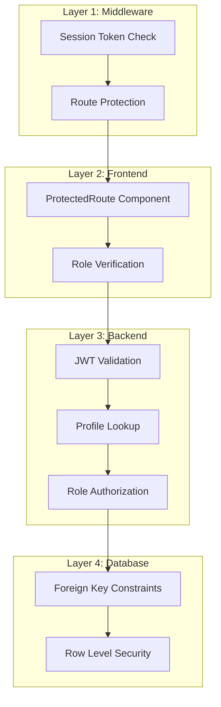
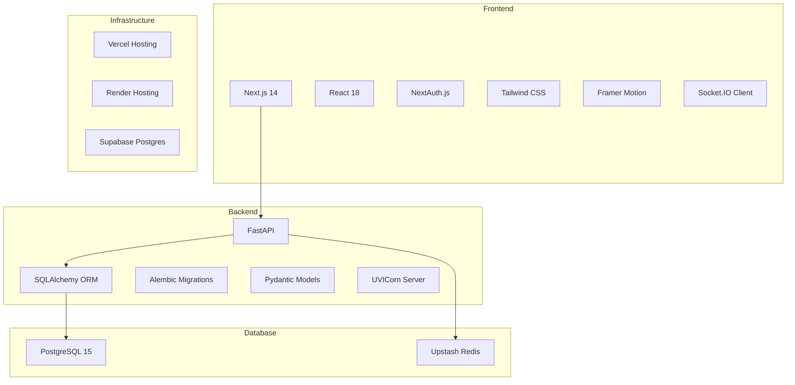
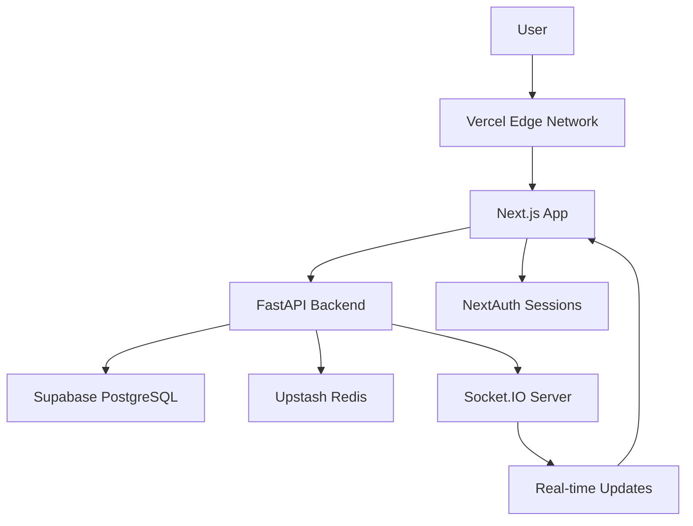

# System Architecture Diagram

## Role-Based Access Control Flow

```mermaid
graph TB
    User[User] --> Login[Login Page]
    Login --> Auth{Authentication}
    Auth -->|Success| JWT[JWT Token with Role]
    Auth -->|Fail| Login
    
    JWT --> Customer{Role Check}
    
    Customer -->|customer| CustomerPortal[/customer Portal]
    Customer -->|driver| DriverPortal[/driver Portal]
    Customer -->|admin| AdminPortal[/admin Portal]
    Customer -->|shop_owner| ShopPortal[/shops Portal]
    
    CustomerPortal --> CustomerAPI[Customer API Endpoints]
    DriverPortal --> DriverAPI[Driver API Endpoints]
    AdminPortal --> AdminAPI[Admin API Endpoints]
    
    CustomerAPI --> ProfileCheck[Profile Role Verification]
    DriverAPI --> ProfileCheck
    AdminAPI --> ProfileCheck
    
    ProfileCheck --> DB[(PostgreSQL)]
    ProfileCheck --> Redis[(Redis Cache)]
```

## Component Hierarchy



## Data Flow



## Portal Architecture



## Database Schema

```mermaid
erDiagram
    USERS ||--|| PROFILES : has
    USERS ||--o{ ORDERS : places
    USERS ||--o{ DRIVER_LOCATIONS : updates
    SHOPS ||--o{ ORDERS : fulfills
    ORDERS ||--o{ ORDER_ITEMS : contains
    ORDERS ||--o{ CHAT_MESSAGES : has
    
    USERS {
        uuid id PK
        string name
        string phone
        string email UK
        UserRole role
        boolean verified
        datetime created_at
    }
    
    PROFILES {
        uuid id PK
        uuid user_id FK UK
        UserRole role
        string avatar_url
        string bio
        string address
        string city
        string state
        string zip_code
        string country
        string emergency_contact_name
        string emergency_contact_phone
        text preferences
        boolean is_active
        datetime last_login
    }
    
    ORDERS {
        uuid id PK
        uuid user_id FK
        uuid shop_id FK
        uuid driver_id FK
        OrderStatus status
        float location_lat
        float location_lng
        string location_address
        string issue_description
        decimal total_amount
        datetime created_at
    }
```

## Security Layers



## Socket.IO Event Flow

```mermaid
graph LR
    Client[Client] --> Connect[Connect to Socket]
    Connect --> JoinRoom[Join Room]
    
    JoinRoom --> AdminRoom[admin_room]
    JoinRoom --> OrderRoom[order_{id}]
    
    AdminRoom --> AdminEvents[Admin Events]
    OrderRoom --> OrderEvents[Order Events]
    
    AdminEvents --> A1[order:new]
    AdminEvents --> A2[order:status_change]
    AdminEvents --> A3[driver:location_update]
    
    OrderEvents --> O1[new_chat_message]
    OrderEvents --> O2[order:image_added]
    
    A1 --> Broadcast[Broadcast to Clients]
    A2 --> Broadcast
    A3 --> Broadcast
    O1 --> Broadcast
    O2 --> Broadcast
```

## Technology Stack



## Deployment Architecture


